# SimpleRPG
매우 간단한 RPG

## 💡 멤버
<table>
 <tr>
    <td align="center"></td>
    <td align="center"></td>
  </tr>
  <tr>
    <td align="center"><a href="https://github.com/dispear"><b>dispear</b></a></td>
    <td align="center"><a href="https://github.com/Pangtaek"><b>Pangtaek</b></a></td>
  </tr>
</table>

 

## ✅ 설명
(1) 시작 화면

- 게임 시작 & 게임 종료 선택
- 시작 후 이름 설정

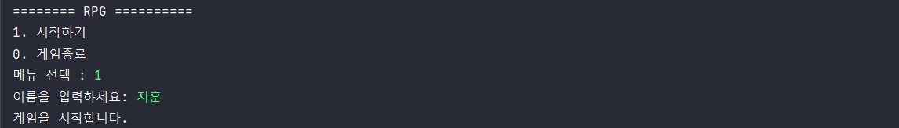

 

(2) 메인 화면

- 내 정보 확인
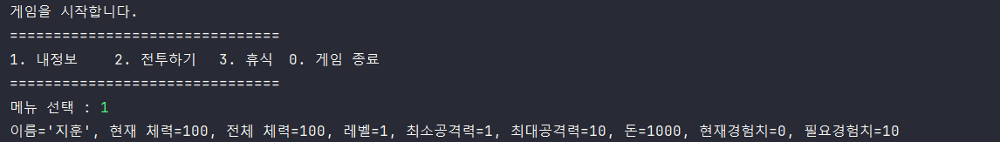

- 전투 하기
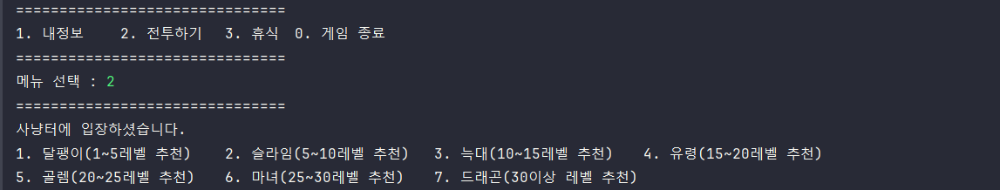

- 휴식 하기

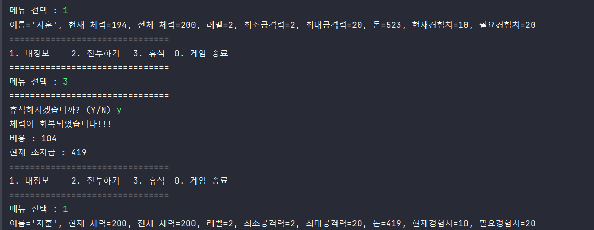

- 게임 종료

 

(3) 전투 화면

- 승리

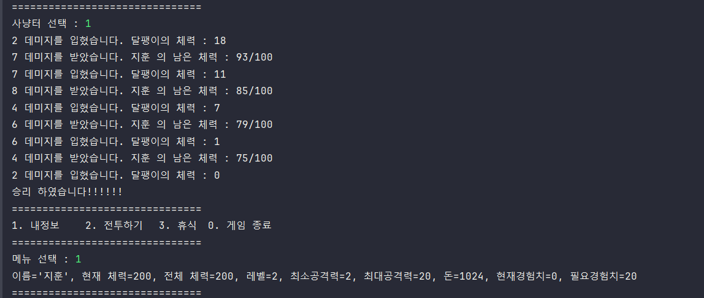

- 패배

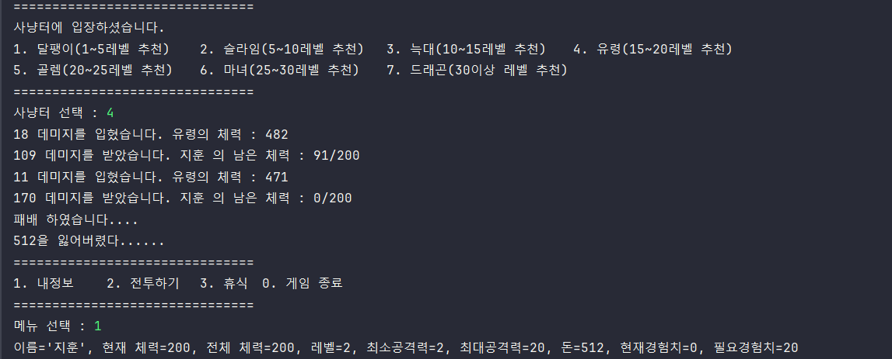

 

## 🔍 구조

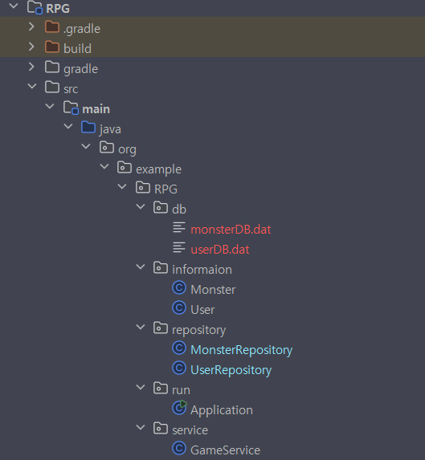

 

## 📌 주요 코드
- 배틀 진행
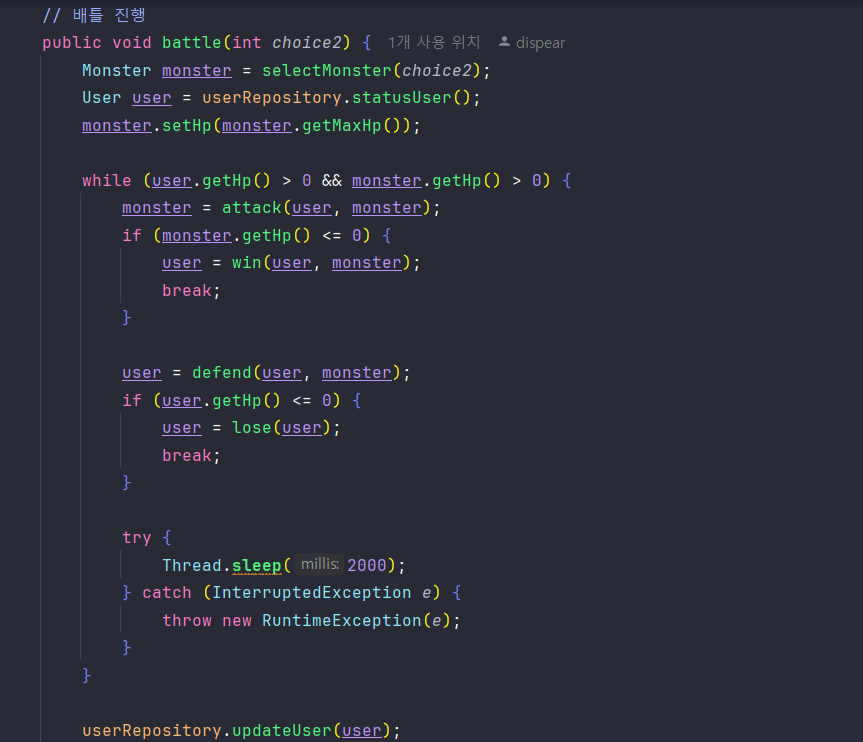

- 유저 공격
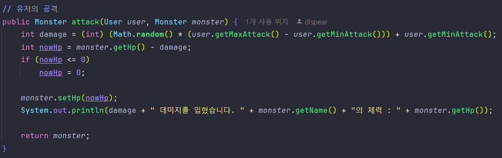

- 몬스터 공격

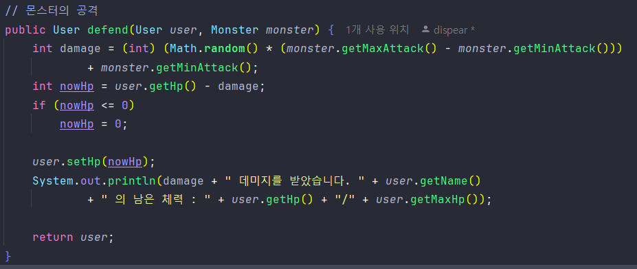

- 승리

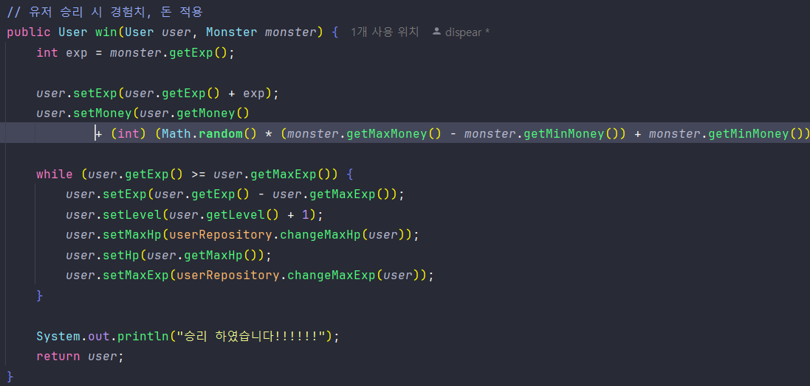

- 패배

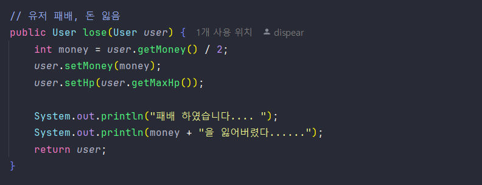

- 휴식

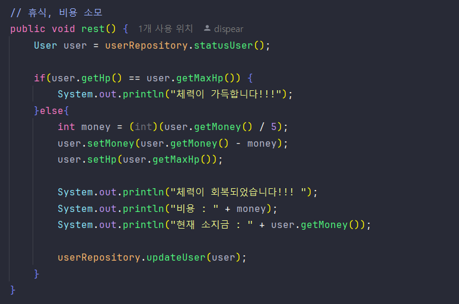

 